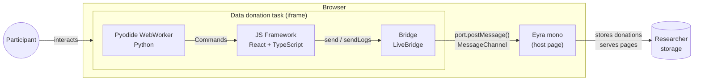

# System Overview

The data donation task is a web application that runs entirely inside a
participant's browser. It guides a participant through uploading their data
download package (DDP), extracts the relevant data locally using Python, shows
the participant what will be shared, and — with their consent — sends the
extracted data to a researcher's storage.

---

## Relationship with Eyra mono

The task runs as an **iframe** embedded in [Eyra mono](https://next.eyra.co/),
the host platform. The two communicate via a **MessageChannel** established
at startup: mono sends a `live-init` message with a `MessagePort`; the
iframe uses that port for all subsequent communication.

In local development, `FakeBridge` replaces `LiveBridge`. It logs commands
to the console and POSTs donations to a local `/data-submission` endpoint,
so the full flow can be tested without a running Eyra instance.

---

## Main components

### Pyodide WebWorker

A standard browser [Web Worker](https://developer.mozilla.org/en-US/docs/Web/API/Web_Workers_API)
that loads [Pyodide](https://pyodide.org/) — a Python runtime compiled to
WebAssembly. The port Python package is installed inside it at startup.

The worker runs the donation script (`script.py`). Because it is a separate
thread, it cannot block the UI.

**Key file:** `packages/data-collector/public/py_worker.js`

### JS Framework (feldspar)

The framework library. Runs on the browser's main thread. Responsible for:

- Managing the worker lifecycle (`WorkerProcessingEngine`)
- Routing commands from Python to the bridge or to the React UI (`CommandRouter`)
- Rendering interactive pages (`ReactEngine`) via a pluggable factory system
- Capturing and forwarding JavaScript-side log entries (`LogForwarder`, `WindowLogSource`)
- Wiring all of the above together (`Assembly`)
- Providing base UI components and default prompt factories

feldspar is a library — it does not run on its own.

**Key files:** `packages/feldspar/src/framework/`

### Application layer (data-collector)

The Vite app that gets built and served. This is the composition root that
wires feldspar together with D3I-specific components:

- Hosts `py_worker.js` (the worker entry point) and the Python wheel
  (`port-0.0.0.tar.gz`) in its `public/` directory
- Registers custom prompt factories for D3I UI components (consent form with
  visualizations, multi-file input, questionnaire, error page, retry prompt)
- Configures `ScriptHostComponent` with the worker URL, log level, and
  standalone/production toggle
- Manages the iframe lifecycle (app-loaded signal, resize observer)

See [Rendering and the factory system](08-rendering.md) for how data-collector
plugs into feldspar's rendering pipeline.

**Key files:** `packages/data-collector/src/App.tsx`, `packages/data-collector/public/`

### The bridge

An abstraction layer with two implementations:

| | `LiveBridge` | `FakeBridge` |
|---|---|---|
| Used in | Production | Dev / test |
| Transport | `MessagePort.postMessage()` to Eyra mono | Console log + HTTP POST to `/data-submission` |
| File | `packages/feldspar/src/live_bridge.ts` | `packages/feldspar/src/fake_bridge.ts` |

Both implement the same `Bridge` interface: `send(command)` for Python-originated
commands, and `sendLogs(entries)` for JS-side log entries.

### Python packages

| Package | Purpose |
|---|---|
| `port.script` | Entry point — `process()` iterates through platforms |
| `port.helpers.flow_builder` | `FlowBuilder` base class — per-platform flow orchestration |
| `port.helpers.validate` | `ValidateInput`, `DDPCategory` — zip structure validation |
| `port.helpers.uploads` | File materialization and safety checks |
| `port.helpers.extraction_helpers` | `ZipArchiveReader` and CSV/JSON parsing utilities |
| `port.helpers.port_helpers` | `emit_log`, `render_page`, `donate` and other helpers |
| `port.api.commands` | `CommandSystem*` and `CommandUIRender` classes |
| `port.api.d3i_props` | `ExtractionResult`, consent form table types |
| `port.api.props` | Core UI prop types (`Translatable`, `PropsUIHeader`, etc.) |
| `port.platforms.*` | Per-platform `FlowBuilder` subclasses |
| `port.main` | `ScriptWrapper` and `error_flow` — the exception safety layer |

---

## Next

→ [The run cycle](02-run-cycle.md) — how Python and JavaScript take turns
