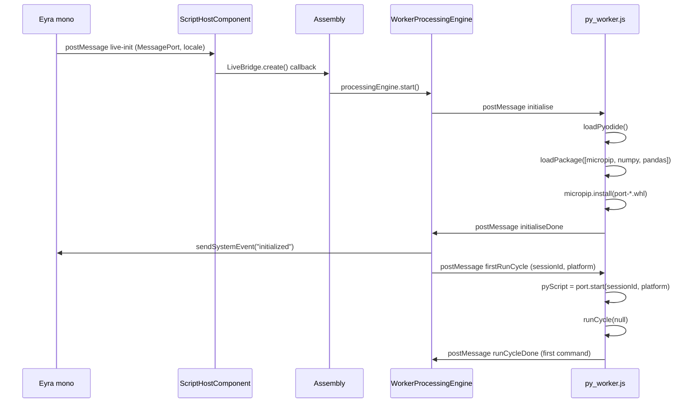
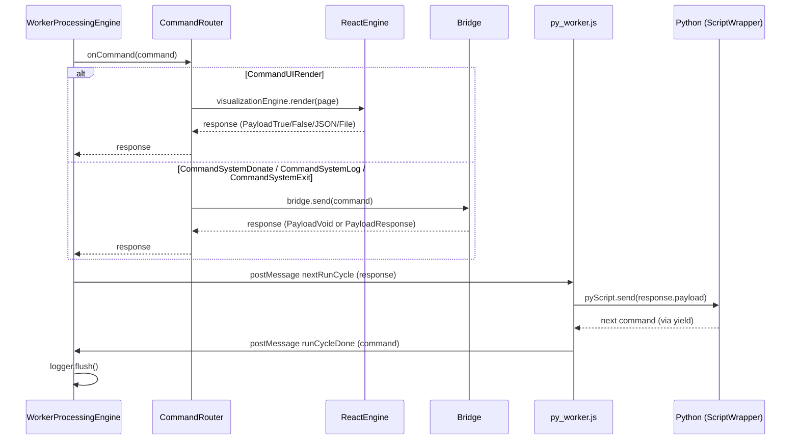

# The Run Cycle

The data donation task is built on a **co-routine pattern**: Python and
JavaScript take turns. Python runs until it has something to show the
participant or something to send to the host, then it yields a command and
pauses. JavaScript handles the command, waits for a response (user interaction
or a host acknowledgement), and sends that response back to Python. Python
resumes with the response as the return value of the `yield`.

This alternation is the heartbeat of the whole system. Every UI interaction,
every log message, every donation — all of it goes through this cycle.

---

## Startup sequence

Before the first run cycle can happen, Pyodide must be loaded and the port
package installed. This takes several seconds on first load.

`port.start(sessionId, platform)` calls `main.start()`, which creates a
`ScriptWrapper` around `script.process()`. The `ScriptWrapper` is a Python
generator. `runCycle(null)` calls `pyScript.send(null)` — the first send to a
generator must pass `None`, which advances it to its first `yield`.

---

## The run cycle loop

After startup, every cycle follows the same pattern:

The cycle ends when Python raises `StopIteration` (the generator is
exhausted), at which point `ScriptWrapper.send()` returns
`CommandSystemExit(0, "End of script")`.

---

## File handling in the worker

When the user selects a file, the response payload is `PayloadFile`, which
contains a browser `File` object. Browser `File` objects cannot be passed
directly into Python — they live in the JS thread and Python runs in the
worker thread.

The worker handles this in `unwrap()`:

1. JS sends `nextRunCycle` with `response.payload.__type__ == "PayloadFile"`
2. `py_worker.js` wraps the `File` in a `FileReaderSync`-backed reader object
3. This reader is sent to Python as a `PayloadFile.value`
4. Python's `AsyncFileAdapter` wraps it, allowing synchronous `.read()` inside the worker
5. `uploads.materialize_file()` writes the bytes to `/tmp` in Emscripten's in-memory filesystem

The `/tmp` filesystem is in-memory and scoped to the worker — no data is
written to the participant's disk, and it is freed when the worker terminates.

---

## Key files

| File | Role |
|---|---|
| `packages/data-collector/public/py_worker.js` | Worker entry point, `runCycle()`, `unwrap()` |
| `packages/feldspar/src/framework/processing/worker_engine.ts` | `WorkerProcessingEngine` |
| `packages/feldspar/src/framework/command_router.ts` | `CommandRouter` |
| `packages/feldspar/src/framework/assembly.ts` | Wires all JS components |
| `packages/python/port/main.py` | `ScriptWrapper`, `start()` |
| `packages/python/port/api/file_utils.py` | `AsyncFileAdapter` |
| `packages/python/port/helpers/uploads.py` | `materialize_file()` |

---

→ [Command protocol](03-command-protocol.md) — what Python can yield and what comes back
