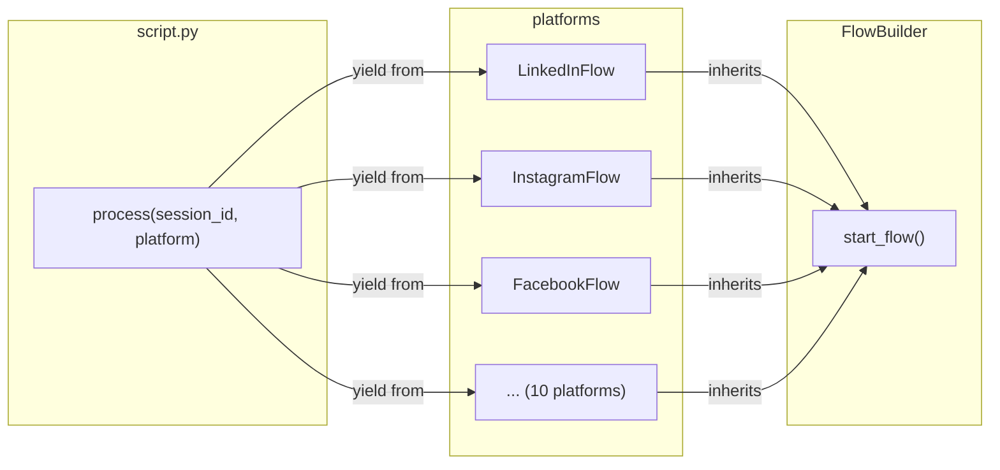
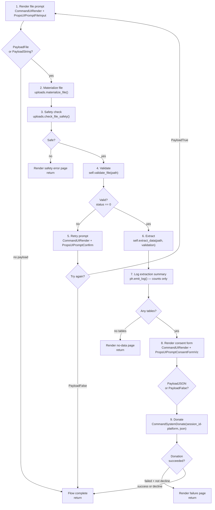

# FlowBuilder

`FlowBuilder` is the base class for every per-platform donation flow. It
owns the complete lifecycle of a single platform's donation: prompting for
a file, validating it, extracting data, presenting a consent form, and
donating the result.

**File:** `packages/python/port/helpers/flow_builder.py`

---

## How it fits in

`script.py` is the study-level orchestrator. It iterates through a registry
of platforms and for each one creates a `FlowBuilder` subclass instance and
calls `yield from flow.start_flow()`. The per-platform flow runs completely
before the next platform begins.



---

## The 11-step flow

`start_flow()` is a generator that implements a fixed lifecycle. It loops
so the participant can retry file selection, and breaks out of the loop once
extraction succeeds.



---

## Emit log milestones

`start_flow()` calls `ph.emit_log()` at each significant step. These are the
messages that appear in the host's log stream. They are always PII-free —
platform name, status code, and counts, never participant data.

| Step | Log message |
|---|---|
| File received | `[Platform] File received: N bytes, PayloadFile` |
| Safety check failed | `[Platform] Safety check failed: FileTooLargeError` |
| Validation passed | `[Platform] Validation: valid (category_id)` |
| Validation failed | `[Platform] Validation: invalid` |
| Extraction complete | `[Platform] Extraction complete: N tables, M rows; errors: ErrorType×count` |
| Consent form shown | `[Platform] Consent form shown` |
| Consent accepted | `[Platform] Consent: accepted` |
| Consent declined | `[Platform] Consent: declined` |
| Donation started | `[Platform] Donation started: payload size=N bytes` |
| Donation result | `[Platform] Donation result: success/failed` |

---

## Implementing a platform

Subclass `FlowBuilder` and implement two methods:

```python
class LinkedInFlow(FlowBuilder):
    def __init__(self, session_id: str):
        super().__init__(session_id, "LinkedIn")  # sets self.platform_name

    def validate_file(self, file: str) -> validate.ValidateInput:
        return validate.validate_zip(DDP_CATEGORIES, file)

    def extract_data(self, file: str, validation: validate.ValidateInput) -> ExtractionResult:
        return extraction(file, validation)
```

- `validate_file(path)` — returns a `ValidateInput`. Status 0 = valid; non-zero = invalid.
- `extract_data(path, validation)` — returns an `ExtractionResult`. Can also be a generator
  (`yield from`) if you need to yield intermediate commands during extraction.

Everything else — the file prompt, the retry loop, the consent form, the
donation, the logging — is handled by `start_flow()`.

---

## UI text

`FlowBuilder.__init__()` calls `_initialize_ui_text()`, which builds a dict
of `Translatable` strings for the file prompt header, consent form header,
retry header, and review description. These are constructed from
`self.platform_name` so they automatically use the platform name you pass to
`super().__init__()`.

Override `_initialize_ui_text()` or modify `self.UI_TEXT` after `super().__init__()`
if you need custom text.

---

## Key files

| File | Role |
|---|---|
| `packages/python/port/helpers/flow_builder.py` | `FlowBuilder` base class |
| `packages/python/port/script.py` | `process()` — iterates platforms |
| `packages/python/port/platforms/linkedin.py` | Example platform implementation |
| `packages/python/port/helpers/port_helpers.py` | `emit_log`, `render_page`, `donate` helpers |

---

→ [Extraction](05-extraction.md) — how `extract_data()` works inside a platform
