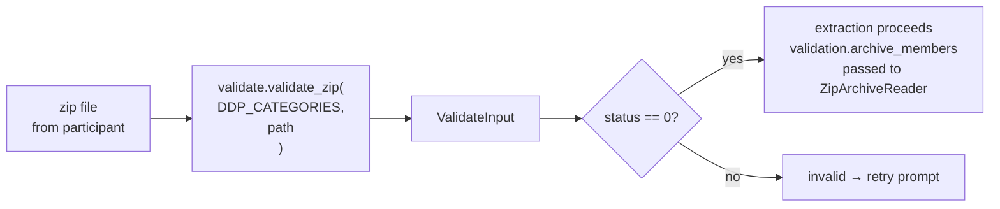

# Extraction

Extraction is the step where Python reads the participant's DDP (Data Donation
Package), parses the files it needs, and produces a set of tables for the
participant to review. This happens entirely inside the Pyodide WebWorker —
no data leaves the browser until the participant explicitly consents.

---

## Validation first

Before extraction begins, `FlowBuilder.start_flow()` calls `self.validate_file(path)`.
Validation answers: *is this the right kind of file?*



`validate_zip()` opens the zip and inspects its file list against a platform's
`DDP_CATEGORIES` — a list of `DDPCategory` objects, each specifying an expected
set of filenames, language, and file type. If enough known files are present,
status 0 is set and `validation.archive_members` is populated with the full
member list.

---

## ZipArchiveReader

`ZipArchiveReader` is the main tool for reading files out of a validated zip.
It is constructed with the zip path, the member list from validation, and a
shared `errors` Counter:

```python
reader = ZipArchiveReader(linkedin_zip, validation.archive_members, errors)
```

It provides two main methods:

| Method | Returns | Use for |
|---|---|---|
| `reader.csv("filename.csv")` | `ReadResult` with a `pd.DataFrame` | CSV files |
| `reader.raw("filename.csv")` | `ReadResult` with `io.BytesIO` | Files needing pre-processing before parsing |

Both return a `ReadResult` with a `found: bool` field. If the file is not in
the zip, `found` is `False` and no error is recorded. This is the standard
pattern for optional files:

```python
result = reader.csv("Company Follows.csv")
if not result.found:
    return pd.DataFrame()   # silently skip
return result.data
```

When a file is found but cannot be parsed (malformed CSV, encoding error, etc.),
`ZipArchiveReader` catches the exception, increments `errors[ExceptionType.__name__]`,
and returns an empty `DataFrame`. This keeps extraction running even when
individual files fail.

**File:** `packages/python/port/helpers/extraction_helpers.py`

---

## ExtractionResult

`extract_data()` must return an `ExtractionResult`:

```python
@dataclass
class ExtractionResult:
    tables: list[PropsUIPromptConsentFormTableViz]
    errors: Counter = field(default_factory=Counter)
```

- `tables` — the data to show the participant in the consent form. Each table
  has an `id`, a `title`, a `data_frame`, and optional `description`,
  `visualizations`, and `headers`.
- `errors` — a `Counter` of exception type names. Keys are class names only
  (e.g. `"KeyError"`, `"FileNotFoundInZipError"`); no messages, no tracebacks.

`FlowBuilder.start_flow()` reads `result.errors` after extraction and formats
it into a PII-free log message: `"errors: KeyError×3, FileNotFoundInZipError×1"`.

---

## The extraction pattern

A typical platform's `extract_data()` function follows this pattern:

```python
def extraction(zip_path: str, validation: ValidateInput) -> ExtractionResult:
    errors = Counter()
    reader = ZipArchiveReader(zip_path, validation.archive_members, errors)

    tables = [
        PropsUIPromptConsentFormTableViz(
            id="linkedin_connections",
            data_frame=connections_to_df(reader, errors),
            title=Translatable({"en": "Your connections", "nl": "Uw connecties"}),
            ...
        ),
        ...
    ]

    return ExtractionResult(
        tables=[t for t in tables if not t.data_frame.empty],
        errors=errors,
    )
```

Each per-file function (`connections_to_df`, etc.) receives the shared `errors`
Counter so it can record failures without interrupting extraction of other files.
The `if not t.data_frame.empty` filter ensures empty tables are not shown to
the participant.

---

## DDPCategory and known files

Each platform defines a list of `DDP_CATEGORIES`. A `DDPCategory` specifies:

- `id` — a string identifier (e.g. `"csv_en"`)
- `ddp_filetype` — `DDPFiletype.CSV`, `.JSON`, `.HTML`, etc.
- `language` — `Language.EN`, `.NL`, etc.
- `known_files` — a list of filenames expected in this DDP variant

Validation succeeds if a sufficient proportion of `known_files` are present
in the zip. If a platform exports in multiple formats (e.g. English JSON,
Dutch HTML), define multiple `DDPCategory` entries and validation picks the
matching one. `validation.current_ddp_category` tells you which category matched.

---

## Key files

| File | Role |
|---|---|
| `packages/python/port/helpers/extraction_helpers.py` | `ZipArchiveReader`, `ReadResult` |
| `packages/python/port/helpers/validate.py` | `ValidateInput`, `DDPCategory`, `validate_zip()` |
| `packages/python/port/api/d3i_props.py` | `ExtractionResult`, `PropsUIPromptConsentFormTableViz` |
| `packages/python/port/platforms/linkedin.py` | Complete example extraction implementation |

---

→ [Logging](06-logging.md) — how extraction errors and milestones reach the host
