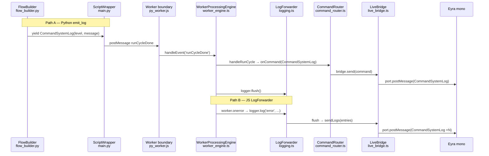

# Logging

Log messages reach the host (Eyra mono's `/api/feldspar/log`) via two
separate paths. Understanding which path a message takes, and why, is
important for knowing what the host will see and what PII rules apply.

---

## Two paths to the host



---

## Path A: Python `emit_log`

**Origin:** Python code explicitly calls `yield from ph.emit_log(level, message)`.

**Route:**
1. `ph.emit_log()` yields a `CommandSystemLog(level, message)`
2. `ScriptWrapper.send()` serialises it via `.toDict()` and returns it
3. `py_worker.js` posts `runCycleDone` with the command dict
4. `WorkerProcessingEngine.handleRunCycle()` passes it to `CommandRouter`
5. `CommandRouter.onCommandSystem()` calls `bridge.send(command)`
6. `LiveBridge.send()` calls `port.postMessage(command)` — the message arrives at Eyra mono

**PII rule:** All messages on Path A **must be PII-free**. This means:
- Error counts from `ExtractionResult.errors` (type names and counts only)
- Flow milestone strings (e.g. `[LinkedIn] Consent: accepted`)
- File size in bytes
- No exception messages, no file paths, no participant data

**Where to use it:** In `FlowBuilder.start_flow()` and `script.py`. Already
called for you at every standard milestone — you only need to add custom
`emit_log` calls if you add non-standard flow steps.

---

## Path B: JS `LogForwarder`

**Origin:** JavaScript-side errors and infrastructure events.

**Sources that feed into `LogForwarder`:**

| Source | Scope | What it captures |
|---|---|---|
| `WindowLogSource` `error` listener | Main thread (`window`) | Synchronous JS errors on the main thread |
| `WindowLogSource` `unhandledrejection` listener | Main thread (`window`) | Unhandled promise rejections on the main thread only — **not** in the worker |
| `WorkerProcessingEngine.worker.onerror` | Main thread (listening on worker) | Synchronous worker errors that propagate to the main thread |
| `WorkerProcessingEngine` internal | Main thread | Worker lifecycle events at `debug` level |

**Scope gap:** Unhandled promise rejections inside the worker (e.g. an
`unwrap()` failure in `py_worker.js`) are not captured by any of these
sources. `WindowLogSource` listens on `window`, not the worker's global scope.
These rejections are silently lost — visible only in the worker's DevTools
console.

**Route:**
1. Error is captured by `WindowLogSource` or `WorkerProcessingEngine`
2. `LogForwarder.log(level, message, context)` adds it to an in-memory buffer
3. Error-level entries trigger an immediate `flush()`; all other levels flush
   after each run cycle
4. The flush callback (wired in `Assembly`) calls `bridge.sendLogs(entries)`
5. `LiveBridge.sendLogs()` formats each entry as a `CommandSystemLog`-shaped
   `postMessage` and posts it to the host

**PII rule:** `WindowLogSource` captures rich context (memory usage, filename,
line number) into the `LogEntry`, and `LogForwarder` records a `timestamp`.
`LiveBridge.sendLogs()` **drops both `context` and `timestamp`** — it only
posts `level` and `message` to the host (plus a `json_string` duplicate for
backwards compatibility). The full `LogEntry` exists in the JS runtime's
`LogForwarder` buffer (visible in DevTools) but those extra fields never cross
the bridge. Raw Python tracebacks also never reach Path B — that is handled by
[error_flow](07-error-handling.md) instead.

**Dead handler note:** `WorkerProcessingEngine.handleEvent()` has a case for
`eventType: 'error'` (a custom worker message), but `py_worker.js` never posts
this event type. The handler exists but is inert on this branch.

---

## What stays local

Not everything is forwarded to the host. The standard Python `logging` module
(via `logger = logging.getLogger(__name__)`) writes to the Pyodide worker's
`stderr`, which appears in the browser's DevTools console. This is the place
for verbose diagnostic detail — full exception messages, intermediate values,
file contents. It never leaves the participant's browser.

| Where | What it contains | Visible to host? |
|---|---|---|
| `emit_log` (Path A) | PII-free milestones and error counts | Yes |
| `LogForwarder` (Path B) | JS errors, worker crashes, context | Yes |
| `logger.info/error(...)` (Python logging) | Full diagnostic detail | No — browser console only |

---

## `CommandSystemLog` format

```python
# Python
CommandSystemLog(level="info", message="[LinkedIn] Consent: accepted").toDict()

# Produces:
{
    "__type__": "CommandSystemLog",
    "level": "info",
    "message": "[LinkedIn] Consent: accepted",
    "json_string": '{"level": "info", "message": "[LinkedIn] Consent: accepted"}'
}
```

`json_string` is a temporary field for backwards compatibility with older Eyra
mono versions that expect it. It will be removed once the host is updated.

---

## Key files

| File | Role |
|---|---|
| `packages/python/port/helpers/port_helpers.py` | `emit_log()` |
| `packages/python/port/api/commands.py` | `CommandSystemLog.toDict()` |
| `packages/feldspar/src/framework/logging.ts` | `LogForwarder`, `WindowLogSource` |
| `packages/feldspar/src/framework/processing/worker_engine.ts` | Flush trigger, `worker.onerror` |
| `packages/feldspar/src/framework/assembly.ts` | Wires `LogForwarder` flush callback to bridge |
| `packages/feldspar/src/live_bridge.ts` | `sendLogs()`, `send()` |

---

→ [Error handling](07-error-handling.md) — what happens when Python throws an unhandled exception
