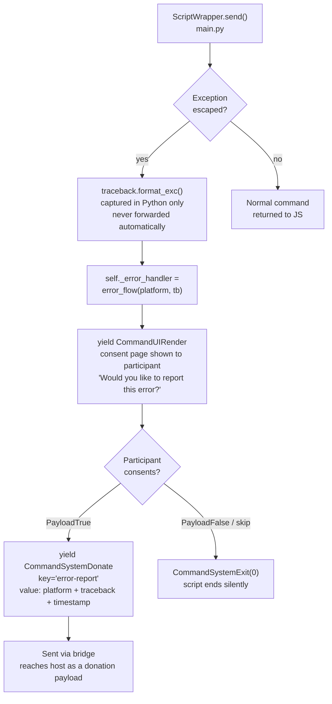
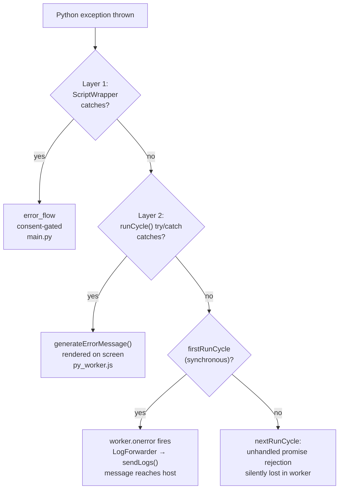

# Error Handling

There are three categories of error in the system, each handled differently.
The dividing lines are chosen to protect participant PII.

---

## Category 1: Expected extraction errors

These are foreseeable failures during file parsing — a missing file in the
zip, a malformed CSV, an unexpected encoding. They are caught inside
`extract_data()`, counted by exception type, and reported as a summary after
extraction completes.

**How it works:**

1. `ZipArchiveReader` catches parsing exceptions internally and increments
   `errors[ExceptionType.__name__]` in the shared `Counter`
2. `extract_data()` returns `ExtractionResult(tables=..., errors=errors)`
3. `FlowBuilder.start_flow()` reads `result.errors` and formats the counts:
   `"errors: FileNotFoundInZipError×2, KeyError×1"`
4. This string is forwarded via `ph.emit_log()` → Path A → host

**What the host sees:** Exception type names and counts. No messages, no
tracebacks, no file contents.

**Where errors accumulate:** `packages/python/port/helpers/extraction_helpers.py`
(`ZipArchiveReader`) and in per-file functions in each platform module.

---

## Category 2: Uncaught Python exceptions — three defense layers

If an exception escapes `extract_data()` — or any other part of the script
generator — there are three layers of defense preventing it from reaching the
host unsanitised. Each layer catches what the previous one missed, with
decreasing PII protection.

### Layer 1: `ScriptWrapper` (Python) — consent-gated

The primary defense. `ScriptWrapper.send()` wraps every call to the script
generator in a try/except. If an exception escapes, it is caught in Python
and routed through `error_flow`.



**Key behaviours:**

- The traceback is shown to the participant on screen, so they can see what
  went wrong. It is not forwarded to the host without their explicit consent.
- If the participant consents, the traceback is donated as structured JSON to
  the key `"error-report"`.
- If the participant declines, the script ends silently — no error is recorded
  anywhere the host can see.
- Once `self._error_handler` is set, all subsequent `send()` calls are routed
  through `error_flow` until it completes.

**What the host sees:** Either nothing, or a full donation payload containing
the traceback — but only with consent.

**File:** `packages/python/port/main.py`

### Layer 2: `runCycle()` try/catch (JS worker) — shown on screen, not forwarded

If `ScriptWrapper` fails to catch the exception (e.g. a bug in `ScriptWrapper`
itself, or an error during Pyodide object conversion), it propagates into
`py_worker.js`. The `runCycle()` function has a try/catch that converts the
error into a `CommandUIRender` via `generateErrorMessage()`:

```javascript
// py_worker.js
function runCycle(payload) {
  try {
    scriptEvent = pyScript.send(payload);
    // ... post runCycleDone with command
  } catch (error) {
    self.postMessage({
      eventType: "runCycleDone",
      scriptEvent: generateErrorMessage(String(error)),
    });
  }
}
```

`generateErrorMessage()` constructs a `PropsUIPageDataSubmission` with the
error text. This is posted as a normal `runCycleDone` event, so it flows
through `CommandRouter` → `ReactEngine` and is **rendered on screen** — not
forwarded to the host via the bridge.

**PII note:** The traceback is shown directly to the participant via
`String(error)` with no consent gate. However, it does not reach the host —
the command is a `CommandUIRender`, not a `CommandSystemLog` or
`CommandSystemDonate`.

**File:** `packages/data-collector/public/py_worker.js`

> **Branch note:** This try/catch was added in commit `f0b77fa` (part of
> `integration/extraction-consolidation`), which builds on
> `integration/bridge-alignment`. It is not present in `bridge-alignment`
> itself — the Layer 2 defense is introduced in the next PR in the stack.

### Layer 3: `worker.onerror` (JS main thread) — limited to synchronous errors

`WorkerProcessingEngine` registers a `worker.onerror` handler:

```typescript
// worker_engine.ts
this.worker.onerror = (error) => {
  this.logger?.log('error', `Python error: ${error.message}`, {
    filename: error.filename,
    lineno: error.lineno,
    colno: error.colno,
  })
}
```

This logs to `LogForwarder`, which flushes immediately (error-level entries
trigger auto-flush), and the message reaches the host via
`LiveBridge.sendLogs()`.

**However, this only catches synchronous errors.** In `py_worker.js`, there
are two call sites for `runCycle()`:

- **`firstRunCycle`** — calls `runCycle(null)` synchronously from `onmessage`.
  If it throws, the error propagates synchronously → `worker.onerror` fires.
  This only happens once at startup.
- **`nextRunCycle`** — calls `runCycle(userInput)` inside a `.then()` callback.
  If it throws, the synchronous throw inside `.then()` becomes a **rejected
  promise**. There is no `.catch()`. This is an unhandled promise rejection
  in the worker's global scope — `worker.onerror` on the main thread does
  **not** fire for these. `WindowLogSource`'s `unhandledrejection` listener
  is on `window` (main thread), not the worker's global scope.

In practice, every run cycle after the first goes through `nextRunCycle`. So
for the common case, **an exception escaping both Layer 1 and Layer 2 would
be silently swallowed** — visible only in the worker's DevTools console,
never reaching `LogForwarder` or the host.

**File:** `packages/feldspar/src/framework/processing/worker_engine.ts`

### Summary of the three layers



| Layer | Where | Consent? | Reaches host? |
|---|---|---|---|
| 1. `ScriptWrapper` | Python (main.py) | Yes — participant must opt in | Only if consented |
| 2. `runCycle()` catch | JS worker (py_worker.js) | No — shown on screen directly | No — rendered as UI, not logged |
| 3. `worker.onerror` | JS main thread (worker_engine.ts) | No | Only for `firstRunCycle` (synchronous); silently lost for `nextRunCycle` (promise rejection) |

---

## Category 3: JavaScript-side errors

Errors originating in JavaScript that are not caused by Python exceptions
never touch `ScriptWrapper` or `error_flow`. They go through
[Path B of the logging system](06-logging.md#path-b-js-logforwarder), but
only if they occur in the right scope:

| Error type | Where it fires | Reaches host? |
|---|---|---|
| Synchronous main-thread error | `WindowLogSource` `error` listener on `window` | Yes |
| Unhandled promise rejection on **main thread** | `WindowLogSource` `unhandledrejection` listener on `window` | Yes |
| Synchronous worker error | `worker.onerror` on main thread | Yes |
| Unhandled promise rejection **in worker** | Nothing — `window` listeners don't see worker-scope rejections | No — silently lost |

**What the host sees (when it reaches the host):** Error level log entries with
`level` and `message` only. The context fields captured by `WindowLogSource`
(memory usage, filename, line number) and the timestamp are dropped by
`LiveBridge.sendLogs()` and never reach the host.

**Scope gap:** `WindowLogSource` listens on `window` (main thread). The worker
has its own global scope. An unhandled promise rejection inside the worker
(e.g. an `unwrap()` failure in `py_worker.js`) does not bubble to the main
thread's `window` — it is invisible to `WindowLogSource` and `LogForwarder`.
This is the same gap that affects Layer 3 of Category 2: the worker has no
`self.addEventListener('unhandledrejection', ...)` handler.

---

## PII safety boundary

The architecture is designed so that raw exception text — which may contain
participant data (file paths, field values, etc.) — is never forwarded to the
host without consent.

| Path | Raw exception text reaches host? |
|---|---|
| `emit_log` (Path A) | No — counts and type names only |
| `error_flow` (Layer 1) | Only with explicit participant consent |
| `runCycle()` catch (Layer 2) | No — rendered on screen, not forwarded |
| `worker.onerror` (Layer 3, `firstRunCycle` only) | Yes — forwarded via `LogForwarder`, but only for the synchronous first cycle |
| Escaped exception in `nextRunCycle` | No — silently lost as unhandled promise rejection in worker |
| `LogForwarder` (Path B, main-thread JS errors) | Message only (context and timestamp dropped), no Python tracebacks under normal operation |
| Unhandled promise rejection in worker | No — silently lost; `WindowLogSource` listens on `window`, not worker scope |
| `logger.error(...)` (Python logging) | No — browser console only |

This boundary is documented in ADR AD0009. The critical design decisions are:

1. **`ScriptWrapper`** catches exceptions in Python before they can propagate
   to the JS engine. This is the primary defense and the only one with a
   consent gate.
2. **`runCycle()` try/catch** (Layer 2) prevents host forwarding if Layer 1
   fails, but shows the traceback to the participant without consent.
3. **`worker.onerror`** (Layer 3) is a narrow fallback — it only catches
   synchronous errors from `firstRunCycle`. For `nextRunCycle` (the common
   case), an exception escaping both Layer 1 and Layer 2 would be silently
   lost. This is arguably a safer failure mode (no PII leak to the host), but
   it means the error is invisible to everyone, including the researcher.

---

## Key files

| File | Role |
|---|---|
| `packages/python/port/main.py` | `ScriptWrapper`, `error_flow()` |
| `packages/python/port/helpers/extraction_helpers.py` | `ZipArchiveReader` — catches extraction errors |
| `packages/python/port/api/d3i_props.py` | `ExtractionResult.errors` Counter |
| `packages/python/port/helpers/flow_builder.py` | Formats error counts for `emit_log` |
| `packages/feldspar/src/framework/processing/worker_engine.ts` | `worker.onerror` — JS-side catch |

---

→ [Rendering and the factory system](08-rendering.md) — how commands become React components on screen
