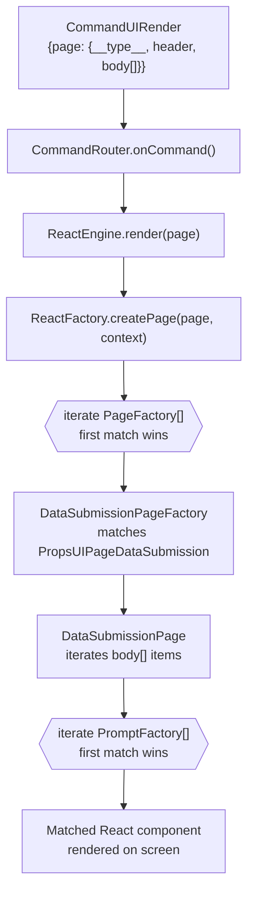
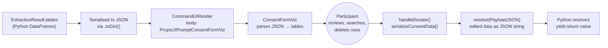
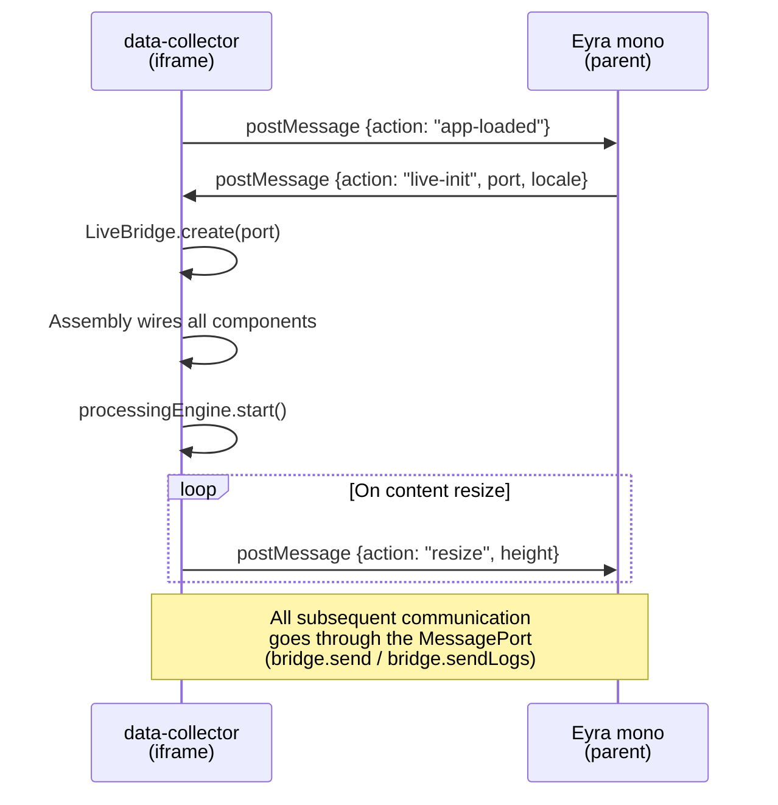

# Rendering and the Factory System

When Python yields a `CommandUIRender`, the JS framework must turn it into a
React component on screen. This is handled by a two-level factory system:
**page factories** decide which page layout to use, and **prompt factories**
decide how to render each item in the page's body.

---

## The two packages

| Package | Role | Depends on |
|---|---|---|
| `feldspar` | Framework — run cycle, bridge, command routing, logging, base UI components | Nothing (library) |
| `data-collector` | Application — composition root, custom UI components, worker entry point, Python wheel | `feldspar` |

`data-collector` is the Vite app that gets built and served. `feldspar` is a
library it consumes via `@eyra/feldspar` (workspace dependency). The split
matters because feldspar provides the engine, while data-collector provides the
D3I-specific experience.

`data-collector/src/App.tsx` is the composition root:

```tsx
<ScriptHostComponent
  workerUrl="./py_worker.js"
  standalone={import.meta.env.DEV}
  logLevel={import.meta.env.DEV ? "debug" : "info"}
  factories={[
    new DataSubmissionPageFactory({
      promptFactories: [
        new ConsentFormVizFactory(),
        new FileInputMultipleFactory(),
        new ErrorPageFactory(),
        new QuestionnaireFactory(),
        new RetryPromptFactory(),
      ],
    }),
  ]}
/>
```

The `standalone` flag determines `LiveBridge` (production, inside Eyra iframe)
vs `FakeBridge` (dev, console + HTTP POST). The `factories` array is where
data-collector plugs its custom components into feldspar's rendering pipeline.

---

## How a CommandUIRender becomes a React component



### Level 1: Page factories

`ReactFactory` holds a list of `PageFactory` instances. When `createPage()` is
called, it tries each factory in order. The first one whose `createPage()`
returns non-null wins.

feldspar always appends one default at the end of the list:

- `DataSubmissionPageFactory` — matches `PropsUIPageDataSubmission`

data-collector passes its own `DataSubmissionPageFactory` (with custom prompt
factories) as the first entry, so it takes priority over feldspar's default.

**File:** `packages/feldspar/src/framework/visualization/react/factory.tsx`

### Level 2: Prompt factories

When `DataSubmissionPage` renders, it iterates the page's `body` array. Each
body item has a `__type__` field. For each item, `DataSubmissionPage` tries
every registered `PromptFactory` in order until one returns a JSX element.

Custom factories (from data-collector) are prepended; feldspar's defaults are
appended by `createPromptFactoriesWithDefaults()`:

```
Custom:   ConsentFormVizFactory, FileInputMultipleFactory, ErrorPageFactory,
          QuestionnaireFactory, RetryPromptFactory
Default:  FileInputFactory, ProgressFactory, ConfirmFactory, RadioInputFactory,
          TableFactory, DonateButtonsFactory, TextBlockFactory
```

Each factory checks `body.__type__` and returns a component or `null`:

```typescript
class ErrorPageFactory implements PromptFactory {
  create(body: unknown, context: ReactFactoryContext) {
    if ((body as any).__type__ === "PropsUIPageError") {
      return <ErrorPage {...body} {...context} />;
    }
    return null;
  }
}
```

**File:** `packages/feldspar/src/framework/visualization/react/ui/prompts/factory.ts`

---

## Prompt factory reference

### feldspar built-in factories

| Factory | Matches `__type__` | Component |
|---|---|---|
| `FileInputFactory` | `PropsUIPromptFileInput` | Single file picker |
| `ProgressFactory` | `PropsUIPromptProgress` | Progress bar |
| `ConfirmFactory` | `PropsUIPromptConfirm` | Confirm / cancel buttons |
| `RadioInputFactory` | `PropsUIPromptRadioInput` | Radio button selection |
| `TableFactory` | `PropsUIPromptConsentFormTable` | Read-only data table |
| `DonateButtonsFactory` | `PropsUIDataSubmissionButtons` | Donate / cancel buttons |
| `TextBlockFactory` | `PropsUIPromptText` | Static text block |

### data-collector custom factories

| Factory | Matches `__type__` | Component | Purpose |
|---|---|---|---|
| `ConsentFormVizFactory` | `PropsUIPromptConsentFormViz` | `ConsentFormViz` | Tables with search, row deletion, pagination, visualizations |
| `FileInputMultipleFactory` | `PropsUIPromptFileInputMultiple` | `FileInputMultiple` | Multi-file upload |
| `ErrorPageFactory` | `PropsUIPageError` | `ErrorPage` | Error display (including synthetic errors from `generateErrorMessage`) |
| `QuestionnaireFactory` | `PropsUIPromptQuestionnaire` | `Questionnaire` | Open and multiple-choice questions |
| `RetryPromptFactory` | `PropsUIPromptRetry` | `RetryPrompt` | Single-button retry (registered but **not used** by standard FlowBuilder — see note below) |

**Note on retry:** The standard `FlowBuilder` retry prompt uses feldspar's
`PropsUIPromptConfirm` (matched by the built-in `ConfirmFactory`), not
`PropsUIPromptRetry`. This is because the retry flow needs both "Try again"
and "Continue" buttons, while `RetryPrompt` only renders a single button.
`RetryPromptFactory` is registered and available for custom flows but is not
exercised by the standard path. See `port_helpers.generate_retry_prompt()`.

---

## The consent form data round-trip

`ConsentFormViz` is the most complex UI component and the one participants
interact with most. It handles the full cycle from extracted data to donated
payload.



**What the participant can do:**

- **Search** within tables (via `SearchBar`)
- **Delete rows** they don't want to share (via checkboxes)
- **Paginate** through large tables
- **View visualizations** (word clouds, charts) if the table defines them

**What gets donated:**

When the participant clicks "Yes, share for research", `serializeConsentData()`
walks the (possibly modified) tables and produces a JSON string. This includes
the remaining rows and a `"deleted row count"` per table. The result is sent
back to Python as `PayloadJSON`, where `FlowBuilder.start_flow()` passes it
to `ph.donate()` → `CommandSystemDonate` → bridge → host.

The key point: **the data that reaches the host may differ from what was
extracted**, because the participant can delete rows before consenting.

**File:** `packages/data-collector/src/components/consent_form_viz/consent_form_viz.tsx`

---

## The resolve callback

Every page component receives a `resolve` function via `ReactFactoryContext`.
This is the mechanism that returns the participant's response back to the run
cycle:

1. `ReactEngine.renderPage()` creates a `Promise` and passes its `resolve`
   to the page component via context
2. The component calls `resolve(payload)` when the participant acts — e.g.
   `resolve({ __type__: "PayloadJSON", value: jsonString })`
3. The promise resolves, `ReactEngine.render()` returns the `Response`
4. `CommandRouter` returns the response to `WorkerProcessingEngine`
5. WPE sends `nextRunCycle` to the worker, which calls `pyScript.send(payload)`
6. Python's `yield` receives the payload

This is how the co-routine loop described in [02-run-cycle](02-run-cycle.md)
connects to visible UI: `resolve` is the bridge from React back into the
run cycle.

**File:** `packages/feldspar/src/framework/visualization/react/engine.tsx`

---

## Iframe lifecycle

`ScriptHostComponent` manages two communication channels with the parent
window that are separate from the `MessageChannel` bridge:

### 1. `app-loaded` signal

On mount, `ScriptHostComponent` posts `{action: "app-loaded"}` to
`window.parent`. Eyra mono listens for this and responds with `live-init`,
which carries the `MessagePort` used to create `LiveBridge`. This is the
handshake that establishes the bridge.

### 2. Resize observer

A `ResizeObserver` watches `document.body` and posts `{action: "resize", height}`
to `window.parent` whenever the content height changes. Mono uses this to
adjust the iframe height so there are no scrollbars inside the iframe.

### Lifecycle sequence



**File:** `packages/feldspar/src/components/script_host_component.tsx`

---

## Key files

| File | Role |
|---|---|
| `packages/data-collector/src/App.tsx` | Composition root — registers factories, configures ScriptHostComponent |
| `packages/data-collector/src/index.tsx` | React entry point |
| `packages/data-collector/public/py_worker.js` | Worker entry point (hosted by data-collector, not feldspar) |
| `packages/data-collector/public/port-0.0.0-py3-none-any.whl` | Python wheel installed in Pyodide at startup (see below) |
| `packages/feldspar/src/components/script_host_component.tsx` | `ScriptHostComponent` — bridge creation, iframe lifecycle |
| `packages/feldspar/src/framework/assembly.ts` | Wires ReactFactory, ReactEngine, CommandRouter, LogForwarder, WorkerProcessingEngine |
| `packages/feldspar/src/framework/visualization/react/factory.tsx` | `ReactFactory` — page factory dispatch |
| `packages/feldspar/src/framework/visualization/react/engine.tsx` | `ReactEngine` — renders pages, manages resolve callbacks |
| `packages/feldspar/src/framework/visualization/react/ui/prompts/factory.ts` | Built-in prompt factories, `createPromptFactoriesWithDefaults()` |
| `packages/feldspar/src/framework/visualization/react/factories/data_submission_page.tsx` | `DataSubmissionPageFactory` |
| `packages/data-collector/src/components/consent_form_viz/consent_form_viz.tsx` | `ConsentFormViz` — table rendering, row deletion, donate serialization |

---

## The Python wheel

The entire `packages/python/port` package — FlowBuilder, extraction helpers,
platform modules, commands, everything — is shipped to the browser as a single
Python wheel: `port-0.0.0-py3-none-any.whl`.

### How it's built

The root `package.json` defines two build steps:

```
build:wheel        →  cd packages/python && poetry build --format wheel
build:install-wheel →  copyfiles -f packages/python/dist/*.whl packages/data-collector/public
```

`pnpm run build:py` runs both in sequence. Poetry reads
`packages/python/pyproject.toml` (name: `port`, version: `0.0.0`), produces
`dist/port-0.0.0-py3-none-any.whl`, and the second step copies it into
data-collector's `public/` directory where Vite serves it as a static asset.

### How it's loaded

During worker initialisation, `py_worker.js` runs:

```javascript
await micropip.install("./port-0.0.0-py3-none-any.whl", deps=False)
```

`micropip` fetches the wheel from the same origin (it's a relative URL to
data-collector's public directory), unpacks it into Pyodide's virtual
filesystem, and makes `import port` available. `deps=False` skips dependency
resolution — pandas and numpy are pre-loaded by `pyodide.loadPackage()` in
the previous step.

### What's in the repo vs what's built

| File | In git? | Notes |
|---|---|---|
| `packages/python/port/` | Yes | Source code — the actual Python package |
| `packages/python/pyproject.toml` | Yes | Poetry project definition (name, version, deps) |
| `packages/python/dist/*.whl` | No | Build artifact, gitignored |
| `packages/data-collector/public/port-0.0.0-py3-none-any.whl` | No | Copied from dist, gitignored |
| `packages/data-collector/public/port-0.0.0.tar.gz` | Yes | Legacy committed sdist — not used by `py_worker.js` (which loads the `.whl`) |

The version is hardcoded at `0.0.0` because it is never published to PyPI —
it only needs to be loadable by micropip inside the worker.

### Dev workflow

During development, `pnpm start` runs `nodemon --ext py --exec "pnpm run build:py"`,
which watches for `.py` file changes and rebuilds + copies the wheel
automatically. A browser refresh then picks up the new wheel.

**Key files:** `packages/python/pyproject.toml`, `package.json` (root, build scripts), `packages/data-collector/public/py_worker.js` (install step)

---

→ Back to [overview](01-overview.md) — the full system in context
